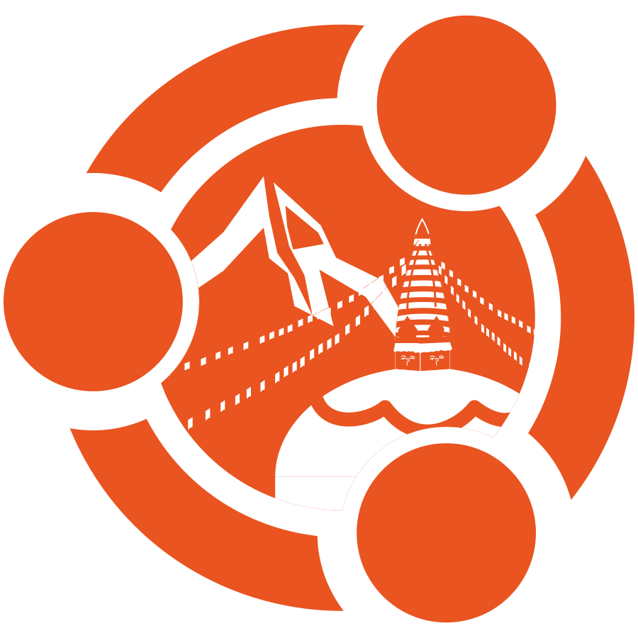

# UbuCon Asia 2025
Mid of September
St. Xavier's College
Kathmandu, Nepal
**Sponsorship prospectus**

<!-- _paginate: skip -->

---

<!-- header:  -->
<!-- footer: https://2025.ubucon.asia | sponsorship@ubucon.asia -->

# About UbuCon Asia

**UbuCon(s) (Ubuntu Conference)** are non-profit events organized by Ubuntu Communities across the world. The events bring together hundreds of Open Source enthusiasts, users, developers, and contributors to share their stories, and experiences regarding **Ubuntu** and relevant free and open source technologies on **servers, desktops, cloud, IoT, robotics, Data, AI/ML and much more.**

In the spirit of promoting the love of Open Source, **UbuCon Asia** is one of the regional UbuCon events that **especially focuses on the Asian region,** organized by Ubuntu Communities and other free and open source communities annually across Asia. This year, we are pleased to share that UbuCon Asia will be hosted at **St. Xavier's College in Kathmandu - Cultural capital of Nepal.**

Being a non-profit event, organized by volunteers without compensation or stable funds, we rely on sponsorships to host these events. Events like these allow community members to learn, share and grow together, meeting many of their peers in person, sometimes even for the first time.

## Event overview

- **Event name:** UbuCon Asia 2025
- **Dates:** Mid of September on weekends
- **Venue:** St. Xavier's College, Kathmandu, Nepal
- **Participant scale:** Around 300 or more
- **Organizer:** UbuCon Asia Committee, GNOME Nepal

---

# Who attends UbuCon Asia

TBD

<pre class="mermaid mermaid-100h">
pie showData
title Participants by profession
    "Students" : 50
    "Web Developer" : 60
    "DevOps Engineer" : 30
    "IoT Engineer" : 30

</pre>

---

# Sponsorship packages

| **Package** | Diamond | Gold | Silver | Bronze | Supporter  |
| --- | --- | --- | --- | --- | --- |
| **Slots** | 1 | 2 | 3 | ∞ | ∞ |
| Price(USD) | 10,000  | 6,000 | 3,500 | 1,600 | 500 - 800 |
| Price(NPR)*0 | TBD  | TBD | TBD | TBD | TBD |
| **Logo exposures** || |
| Website | XL | L | M | S | S |
| Plenary banner*1 | XL | L | M | S | XS |
| Stage (or Podium) banner | Yes | Yes | Yes | No | No |
| Nametag | Yes | Yes | No | No | No |
| Video banner*2 | Yes | Yes | No | No | No |
| Video sponsor information scene*3 | Yes | Yes | Yes | Yes | Yes |
| T-Shirt (or other swag if no T-shirt) | Yes | Yes | No | No | No |
| **Recognition** || |
| Recognition posting on social media | Yes | Yes | Yes | Yes | Yes |
| Recognition posting on blog | Yes | Yes | No | No | No |
| Mention during opening and closing session | Yes | Yes | Yes | Yes | Yes |
| **Engagements** || |
| Sponsored session*4 | A Keynote<small>(30min)</small>  + A Workshop<small>(90min)</small>,  A Talk<small>(30min)</small>  or A BoF<small>(40-50min)</small> | A Talk<small>(30min)</small> or A Workshop<small>(90min)</small> | A Talk<small>(30min)</small> | A Lightning talk(5min) <small>(Limited FCFS)</small> | No |
| Sponsor booth | L | M | S*5 | S*5 <small>(500 USD Add-on FCFS)</small> | No |
| Promotion video during breaks | 3min | 2min | 1min | No | No |
| Distribute Promotional Material  | Handout on attendee check-in + At booth | Handout on attendee check-in + At booth | At booth | At booth <small>(If booth allocated)</small> | No |
| Promotional Email to all Attendees*5 | Yes (One-time with custom content) | Yes (One-time with custom content) | Yes (One-time with custom content) | No | No |

Refer to next page for footnotes and additional sponsorship oppertunities.

---
# Sponsorship packages
## Footnotes

- *0: Price in Nepalese Rupees (NPR) is for business with primary office in Nepal.
- *1: A large size banner installed in reception area usually or enterance of the venue that number of attendees can take photo with banner as backdrop.
- *2: Banner of both live streams and video recordings if sessions will be streams or just on video recordings if not.
- *3: Duration of Scene will be around a few seconds in the video or live streams. 
- *4: Sponsored sessions are also subject to approval by the UbuCon Asia content team. Sponsors are required to share the Abstract alongside or before availing sponsorship for review. Note that session should be Ubuntu or relevant Open Source topics and need to comply with our Code of Conducts. Also, Sales or marketing pitches are not allowed.
- *5: Depending on logistics availability, this could be Booth with Size M but with located in less accessible area.
- *6: If sponsor desires, this could be replaced with "List of participants data with names, affiliation, job profession and email address". Only data from attendees opt-in to provide their data to sponsors during registration will be provided to sponsors. Attendees will be also informed about data provision to sponsors through registration form and also privacy policy if available.

## Additional sponsorship oppertunities

You may also become our in-kind sponsor by sponsoring coffee break, lunch, conference dinner, day trip, diversity initiatives and more! We’ll work with you to put together the right UbuCon Asia package for your company or organization. These additional opportunities may be sponsored separately or added on to a sponsorship package.

If there are no sponsorship packages that fits your budget and needs, We're also open to discuss adjust existing package or designing package tailored for you.

Please contact us at [sponsorship@ubucon.asia](mailto:sponsorship@ubucon.asia) to discuss such oppertunities! 